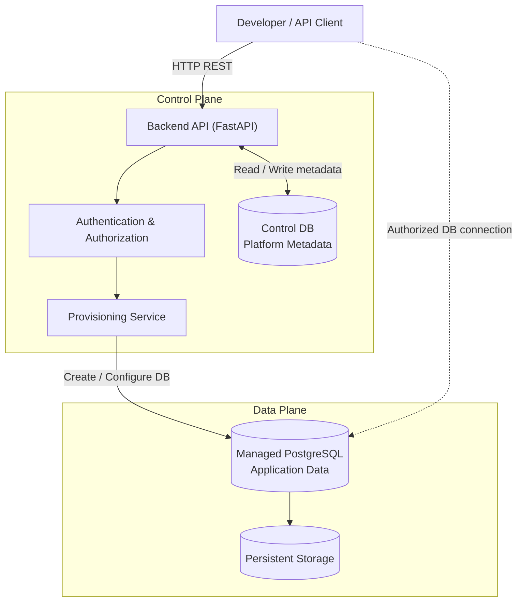

# Mini DBaaS - Architecture

## 1. General architecture

```mermaid
flowchart TD
    DEV["Developer / API Client"]

    subgraph CONTROL["Control Plane"]
        API["Backend API (FastAPI)"]
        AUTH["Authentication & Authorization"]
        PROV["Provisioning Service"]
        META[("Control DB<br/>Platform Metadata")]
    end

    subgraph DATA["Data Plane"]
        DB[("Managed PostgreSQL<br/>Application Data")]
        STORAGE[("Persistent Storage")]
    end

    DEV -->|"HTTP REST"| API
    API --> AUTH
    AUTH --> PROV
    API <-->|"Read / Write metadata"| META
    PROV -->|"Create / Configure DB"| DB
    DB --> STORAGE
    DEV -.->|"Authorized DB connection"| DB
```
